# 实验一 无人值守Linux安装镜像制作
## 一、实验目的
- 制作linux无人值守安装镜像，实现在virtualbox中的自动化安装
- 利用putty实现对虚拟机的远程控制（方便配置时的复制粘贴），并通过配置ssh实现免密登录
- 学会使用sftp在虚拟机与宿主机之间传输文件


## 二、实验环境
- windows10
- Virtualbox
- ubuntu18.04-server-amd64
    - 开启两块网卡
        - NAT
        - Host-only
## 三、实验过程
### 1. 有人值守安装Ubuntu18.04-server版虚拟机，配置host-only网卡
- ```sudo vim /etc/netplan/01-netcfg.yaml```，追加如下内容
    ```
    enp0s8
    dhcp4:yes
    ```
    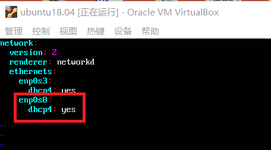
- ```sudo netplan apply```应用新的配置
- ```ifconfig```查看网卡，添加正确

    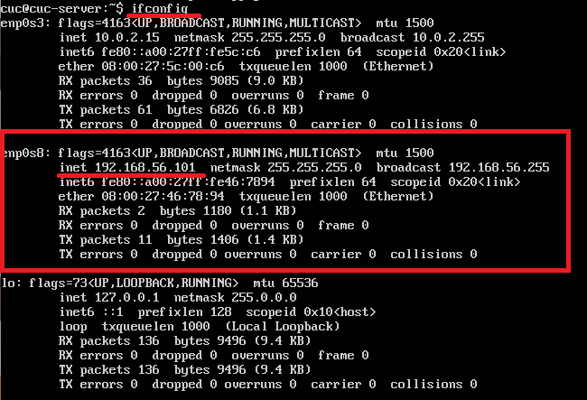

### 2. 使用putty远程登录虚拟机，并配置免密登录
- [下载安装](https://www.chiark.greenend.org.uk/~sgtatham/putty/latest.html)putty.exe和puttygen.exe
    - putty.exe——远程登录虚拟机
    - puttygen.exe——生成密钥对，实现免密登录
- Ubuntu-18.04-server的有人值守安装过程中已经安装了ssh server,确认是否正常工作
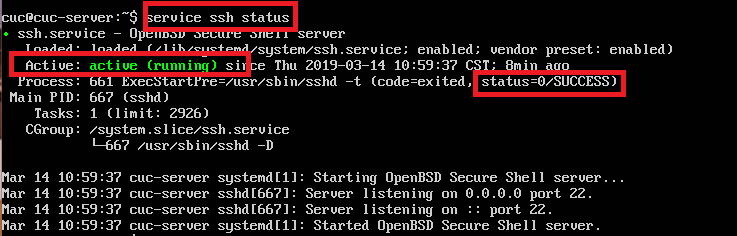
- 打开putty.exe设置Host Name为Host-only网卡ip地址，即可实现远程登录虚拟机
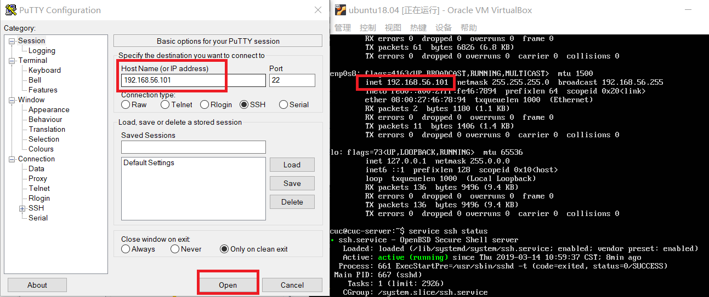
- 利用puttygen.exe实现免密登录
    - generate生成秘钥对
    - 将私钥保存在宿主机本地
    - 复制公钥
    
    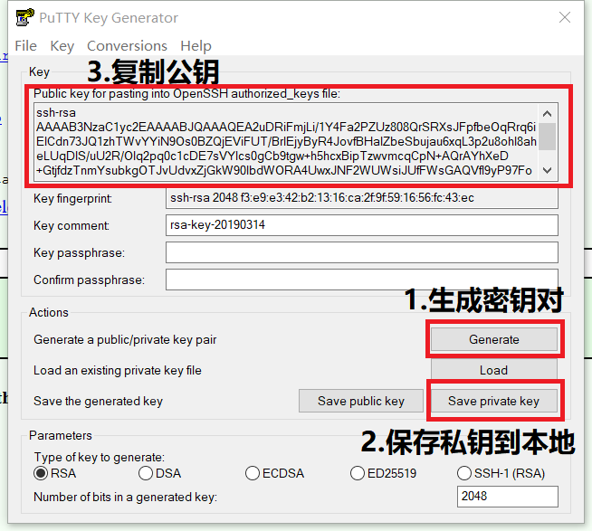

   - 创建~/.ssh/authorized_keys文件，并粘贴公钥保存
   
       
       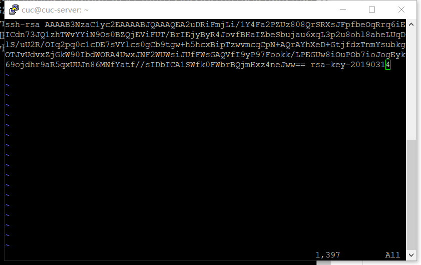
    - putty.exe——>SSH——>Auth,加载私钥文件，再次登录无需输入密码，成功
        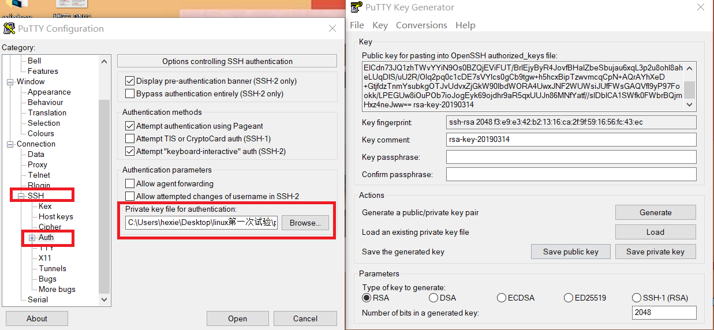
        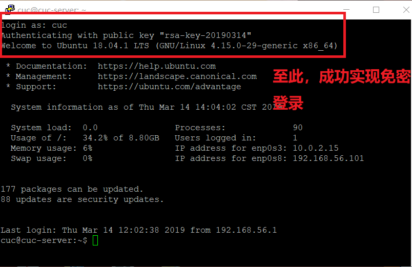


### 3.制作无人值守的镜像文件
- 执行如下命令
    ```
    # 在当前用户目录下创建一个用于挂载iso镜像文件的目录
    mkdir loopdir
    
    # 下载Ubuntu-16.04.1-server-amd64.iso
    wget http://sec.cuc.edu.cn/ftp/iso/ubuntu-16.04.1-server-amd64.iso
    
    # 挂载iso镜像文件到该目录
    sudo mount -o loop ubuntu-16.04.1-server-amd64.iso loopdir
    
    # 创建一个工作目录用于克隆光盘内容
    mkdir cd
    
    # 同步光盘内容到目标工作目录
    # 一定要注意loopdir后的这个/，cd后面不能有/
    rsync -av loopdir/ cd
    
    # 卸载iso镜像
    sudo umount loopdir
    
    # 进入目标工作目录，之后在虚拟机里的操作都在该目录下进行
    cd cd/
    
    # 编辑Ubuntu安装引导界面增加一个新菜单项入口
    vim isolinux/txt.cfg
      # 在txt.cfg中添加以下内容
      label autoinstall
         menu label ^Auto Install Ubuntu Server
         kernel /install/vmlinuz
      append  file=/cdrom/preseed/ubuntu-server-autoinstall.seed debian-installer/locale=en_US console-setup/layoutcode=us keyboard-configuration/layoutcode=us console-setup/ask_detect=false localechooser/translation/warn-light=true localechooser/translation/warn-severe=true initrd=/install/initrd.gz root=/dev/ram rw quiet
    ```
- putty远程登录查看被修改后的txt.cfg，可以看到已经增添了相应内容
   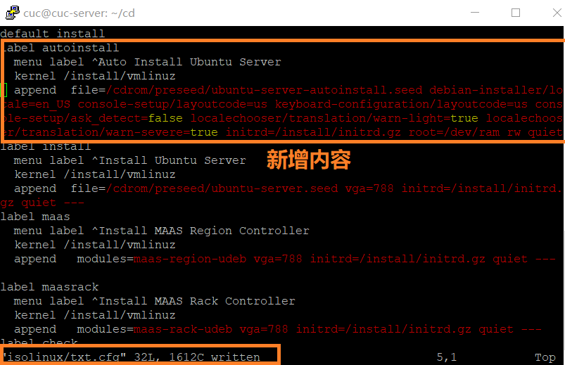
- 下载之前定制好的ubuntu-server-autoinstall.seed于宿主机，通过sftp传入虚拟机
    - 打开git bash
    - 执行命令```sftp cuc@192.168.56.101```,输入密码后成功连接到192.168.56.101
    - 执行命令```put C:/Users/hexie/Desktop/linux第一次试验/ubuntu-server-autoinstall.seed /home/cuc/cd/preseed```,报错“Permission denied”，因权限不够故修改最终保存路径为```/home/cuc/```，在虚拟机中通过```mv /home/cuc/ubuntu-server-autoinstall.seed /home/cuc/cd/preseed ```命令将seed文件移至preseed文件夹中，查看preseed，seed文件存在，成功
    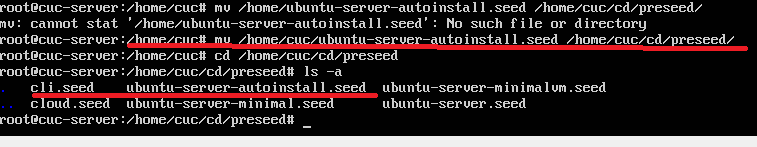
    
- putty中vim打开isolinux/isolinux.cfg文件，修改timeout=0改为timeout=10
- 重新生成md5sum.txt
    - 执行指令：cd ~/cd && find . -type f -print0 | xargs -0 md5sum > md5sum.txt
    - 第一次执行时报错，切换为root用户，再次执行，成功
     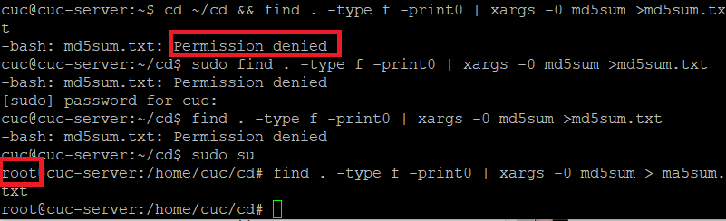
- 打开shell脚本，添加内容保存退出，然后执行shell

    ```
    # 打开脚本
    vim shell
    
    # 添加以下内容
    # 封闭改动后的目录到.iso
    IMAGE=custom.iso
    BUILD=/home/cuc/cd/ #当前root用户，不能直接写~/cd/
    
    mkisofs -r -V "Custom Ubuntu Install CD" \
               -cache-inodes \
               -J -l -b isolinux/isolinux.bin \
               -c isolinux/boot.cat -no-emul-boot \
               -boot-load-size 4 -boot-info-table \
               -o $IMAGE $BUILD
    
    
    # 执行shell脚本。注意第一次尝试时会提醒没有mkisoft命令，要先下载genisoimage(下载之前记得apt update)
    sudo bash shell
    
    ```
    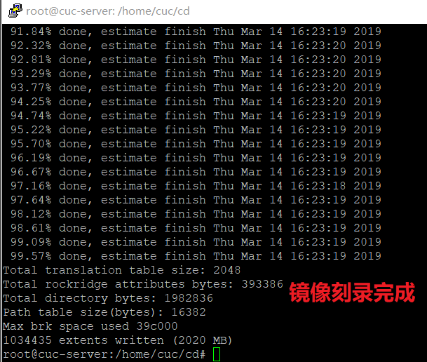
- 将制作完成的custom.iso通过sftp传到宿主机，git bash执行命令```get /home/cuc/cd/custom.iso C:/Users/hexie/Desktop/linux第一次试验/```
     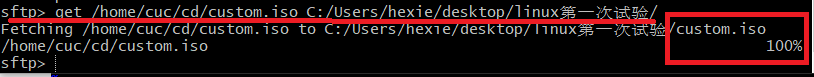

- 至此，镜像制作完毕，可以使用custom.iso新装一台Ubuntu-16.04-server版本虚拟机
    - [安装过程视频演示](http://xiaoying.tv/v/zlhfCr/1/?fromApp=XiaoYing&toApp=copylink)
--- 
## 四、思考
- 使用在线文本对比工具（Diffchecker）对比官方实例和修改过的.seed文件
    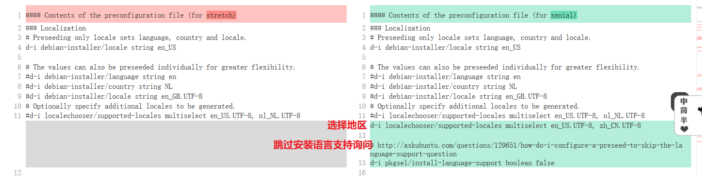
    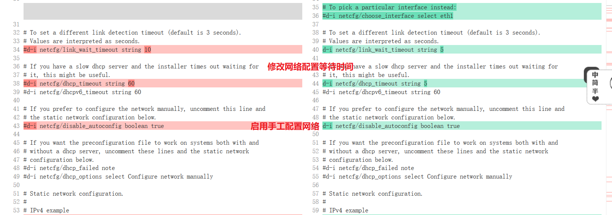
    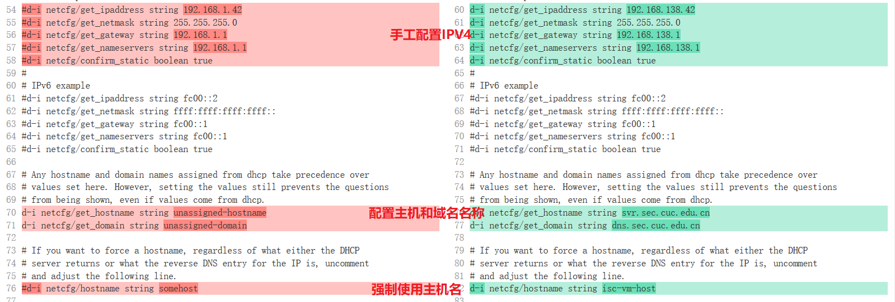
    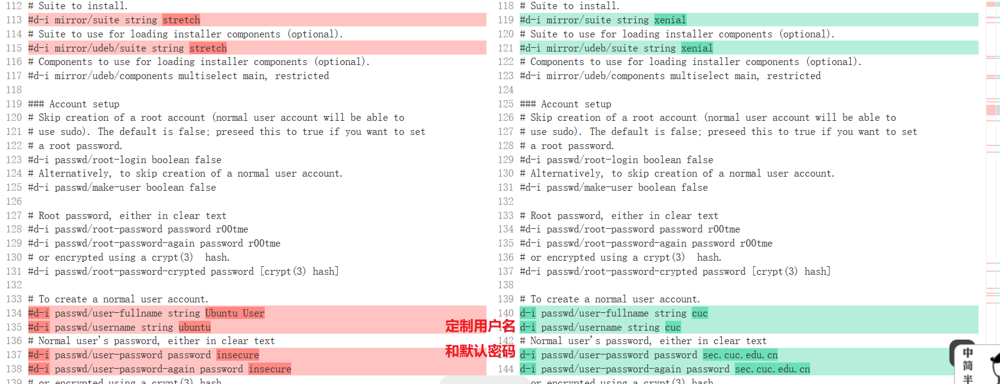
    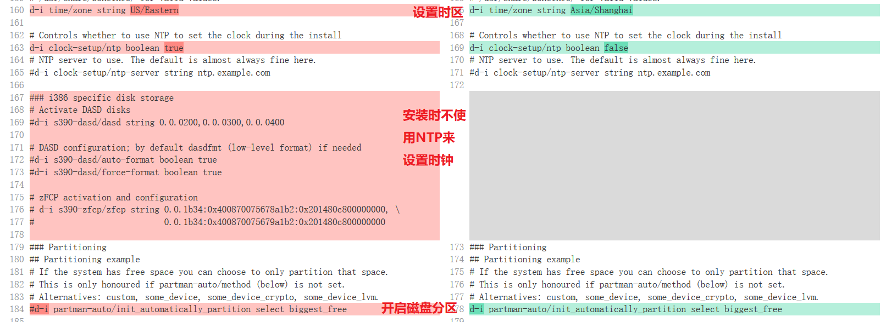
    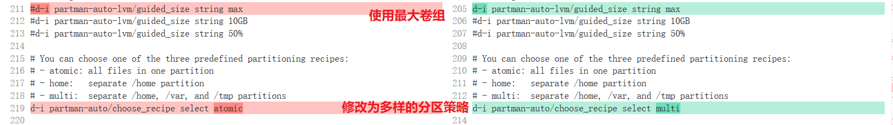
    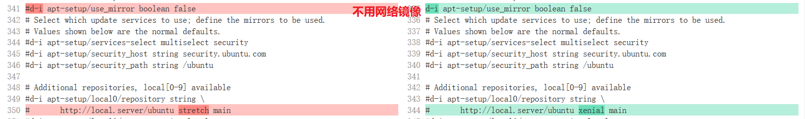
    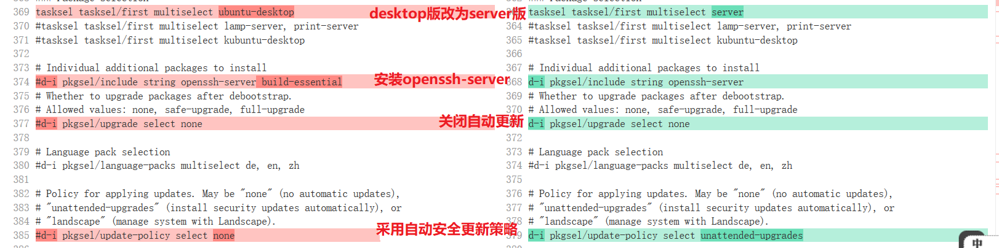


## 五、参考
[CUCCS/linux-2019-FLYFLY-H](https://github.com/CUCCS/linux-2019-FLYFLY-H/blob/linux_exp1/exp_1.md)

[第一次实验指导](http://sec.cuc.edu.cn/huangwei/course/LinuxSysAdmin/chap0x01.exp.md.html#/6/3)

[sftp常用命令](https://blog.csdn.net/qq_24309787/article/details/80117269)

[vim命令](https://blog.csdn.net/qinfuan2017/article/details/79728906)

[puttty免密登录](https://blog.csdn.net/tajun77/article/details/51043675)