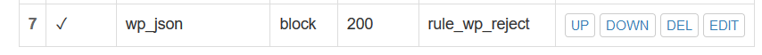

# 实验五 Web服务器搭建
## 一、实验目标

### Part1 基本要求：
- 在一台主机（虚拟机）上同时配置Nginx和VeryNginx
    - VeryNginx作为本次实验的Web App的反向代理服务器和WAF
    - PHP-FPM进程的反向代理配置在nginx服务器上，VeryNginx服务器不直接配置Web站点服务
- 使用Wordpress搭建的站点对外提供访问的地址为： https://wp.sec.cuc.edu.cn
- 使用Damn Vulnerable Web Application(DVWA)搭建的站点对外提供访问的地址为： http://dvwa.sec.cuc.edu.cn
### Part2 安全加固要求：
- 使用IP地址方式均无法访问上述任意站点，并向访客展示自定义的友好错误提示信息页面-1
- Damn Vulnerable Web Application (DVWA)只允许白名单上的访客来源IP，其他来源的IP访问均向访客展示自定义的友好错误提示信息页面-2
- 在不升级Wordpress版本的情况下，通过定制VeryNginx的访问控制策略规则，热修复WordPress < 4.7.1 - Username Enumeration
- 通过配置VeryNginx的Filter规则实现对Damn Vulnerable Web Application (DVWA)的SQL注入实验在低安全等级条件下进行防护
### Part3 VERYNGINX配置要求

- VeryNginx的Web管理页面仅允许白名单上的访客来源IP，其他来源的IP访问均向访客展示自定义的友好错误提示信息页面-3
- 通过定制VeryNginx的访问控制策略规则实现：
    - 限制DVWA站点的单IP访问速率为每秒请求数 < 50
    - 限制Wordpress站点的单IP访问速率为每秒请求数 < 20
    - 超过访问频率限制的请求直接返回自定义错误提示信息页面-4
    - 禁止curl访问


## 二、实验环境
- **虚拟机**：ubutun 18.04 server
    - NAT
    - Host-Only：192.168.232.3
- **宿主机**：windows10


## 三、实验过程
### Part1 基本要求
#### 1.安装Nginx
```
sudo apt-get update
sudo apt install nginx
```
#### 2.安装veryNginx
```bash
git clone https://github.com/alexazhou/VeryNginx.git
cd VeryNginx
python3 install.py install

# 报错后根据提示信息安装依赖项
apt install openssl libssl1.0-dev 
apt install libpcre3 libpcre3-dev
apt install zlib1g-dev
apt install build-essential

python3 install.py install # 成功

# 创建软链接简化命令方便使用
ln -s /opt/verynginx/openresty/nginx/sbin/nginx /usr/sbin/verynginx
# 检查配置文件是否正确
verynginx -t
# 若正确则启动verynginx
verynginx
```

- 配置文件```/opt/verynginx/openresty/nginx/conf/nginx.conf```第二行user nginx 为默认用户 改为“www-data”
- 启动VeryNginx ```sudo verynginx```
- 用宿主机访问```http://192.168.232.2/verynginx/index.html``


#### 3.安装wordpress并配置SSL
- 根据[教程](https://www.digitalocean.com/community/tutorials/how-to-install-wordpress-with-lemp-on-ubuntu-18-04#step-1-%E2%80%94-creating-a-mysql-database-and-user-for-wordpress)创建wordpress数据库，安装wordpress
    ```bash
    # 安装mysql
    sudo apt install mysql-server
    sudo mysql -u root -p
    
    mysql> CREATE DATABASE wordpress DEFAULT CHARACTER SET utf8 COLLATE utf8_unicode_ci;
    mysql> GRANT ALL ON wordpress.* TO 'wordpressuser'@'localhost' IDENTIFIED BY 'password';
    mysql> FLUSH PRIVILEGES;
    mysql> exit;
    
    sudo systemctl restart mysql
    
    # 安装PHP拓展
    sudo apt install php-curl php-gd php-intl php-mbstring php-soap php-xml php-xmlrpc php-zip
    
    sudo apt install php7.2-fpm
    
    sudo systemctl restart php7.2-fpm
    
    # 下载安装WordPress
    cd /tmp
    curl -LO https://wordpress.org/latest.tar.gz
    tar xzvf latest.tar.gz
    # 移动到根目录中
    sudo cp -a /tmp/wordpress/. /var/www/html/wordpress
    
    #安装php-mysql
    sudo apt install php-mysql
    ```

- 生成wordpress的私钥和证书```sudo openssl req -x509 -nodes -days 365 -newkey rsa:2048 -keyout /etc/ssl/private/wp-selfsigned.key -out /etc/ssl/certs/wp-selfsigned.crt```

- 修改nginx配置文件```sudo vim /etc/nginx/sites-enabled/default```

    ```
    server {
            listen 443;
            server_name wp.sec.cuc.edu.cn;
            root /var/www/html/wordpress;
            index index.php index.php index.nginx-debian.php;
            
            ssl on;
            ssl_certificate /etc/ssl/certs/wp-selfsigned.crt;
            ssl_certificate_key /etc/ssl/private/wp-selfsigned.key;
            
            location ~ \.php$ {
                include snippets/fastcgi-php.conf;
                fastcgi_pass unix:/run/php/php7.2-fpm.sock;
            }
            
            location / {
                    try_files $uri $uri/ =404;
            }
    }
    
    ```
- ```sudo vim /var/www/html/wordpress/wp-config.php```修改数据库名、密码、用户名

    

- 宿主机访问```https://wp.sec.cuc.edu.cn```

#### 4.安装DVWA
    ```
    sudo git clone https://github.com/ethicalhack3r/DVWA
    sudo cp -a ~/workspace/DVWA/ /var/www/html/
    
    cp /var/www/html/DVWA/config/config.inc.php.dist /var/www/html/DVWA/config/config.inc.php
    
    chown -R www-data.www-data /var/www/html/DVWA
    ```
- 与wordpress类似，创建数据库
    ```bash
    mysql> CREATE DATABASE dvwa DEFAULT CHARACTER SET utf8 COLLATE utf8_unicode_ci;
    mysql> GRANT ALL ON dvwa.* TO 'dvwauser'@'localhost' IDENTIFIED BY 'password';
    mysql> FLUSH PRIVILEGES;
    mysql> exit;
    ```
- ```sudo vim /var/www/html/DVWA/config/config.inc.php```，修改数据库名、用户名
    ```
    $_DVWA[ 'db_server' ]   = '127.0.0.1';
    $_DVWA[ 'db_database' ] = 'dvwa';
    $_DVWA[ 'db_user' ]     = 'dvwauser';
    $_DVWA[ 'db_password' ] = 'password';
    ```

- ```sudo vim /etc/php/7.2/fpm/php.ini. ```，做如下修改：
    ```
    allow_url_include = on
    allow_url_fopen = on
    display_errors = off
    ```
- 保存之后重启php ```sudo systemctl restart php7.2-fpm```
- ```sudo vim /etc/nginx/sites-enabled/default```，为nginx配置文件添加以下内容：
    
    ```
    server {
        listen 5566; 
        root /var/www/html/DVWA;
        index index.php index.php index.nginx-debian.php;
        server_name dvwa.sec.cuc.edu.cn;
        location / {
                try_files $uri $uri/ =404;
        }
        location ~ \.php$ {
                include snippets/fastcgi-php.conf;
                fastcgi_pass unix:/run/php/php7.2-fpm.sock;
        } 
    }
    ```

- 重启nginx```sudo systemctl restart nginx```
- 访问```http://dvwa.sec.cuc.edu.cn:5566```


### 5.VeryNginx配置反向代理
- config->Basic->Matcher,在Request Matcher里添加以下规则：
    
- config->Backend->Proxy Pass, 在Proxy Pass下添加以下规则
    

---

### Part 2 安全加固要求
#### 1.使用IP地址方式均无法访问上述任意站点，并向访客展示自定义的友好错误提示信息页面-1
- 在Request Matcher里添加以下规则
    
- 在Response里添加以下规则
    
- 在Filter里添加以下规则
    
- 测试
    

#### 2.DVWA只允许白名单上的访客来源IP，其他来源的IP访问均向访客展示自定义的友好错误提示信息页面-2
- 在Request Matcher里添加以下规则
    
- 在Response里添加以下规则
    
- 在Filter里添加以下规则
    
- 测试


#### 3.在不升级Wordpress版本的情况下，通过定制VeryNginx的访问控制策略规则，热修复WordPress < 4.7.1 - Username Enumeration
- 在Request Matcher里添加以下规则
    
- 在Response里添加以下规则
    
- 在Filter里添加以下规则
    
- 测试
    

#### 4. 通过配置VeryNginx的Filter规则实现对Damn Vulnerable Web Application (DVWA)的SQL注入实验在低安全等级条件下进行防护

- 在Request Matcher里添加以下规则
    

- 在Response里添加以下规则
    

- 在Filter里添加以下规则
    

- 设置DVWA的安全等级为**Low**
    

- 未开启filter前：
    
- 开启后应该是返回response页面，但测试后发现未被过滤，还未能解决该问题


---
### Part3 VeryNginx配置
- VeryNginx的Web管理页面仅允许白名单上的访客来源IP，其他来源的IP访问均向访客展示自定义的友好错误提示信息页面-3
- request:
    
- response:
    
- filter:
    

- 通过定制VeryNginx的访问控制策略规则实现：
    - 限制DVWA站点的单IP访问速率为每秒请求数 < 50
    - 限制Wordpress站点的单IP访问速率为每秒请求数 < 20
    - 超过访问频率限制的请求直接返回自定义错误提示信息页面-4

   
- 禁止curl访问
   


## 四、参考
- [linux-2019-FLYFLY-H](https://github.com/CUCCS/linux-2019-FLYFLY-H/blob/linux_exp5/exp5/%E5%AE%9E%E9%AA%8C%E6%8A%A5%E5%91%8A%E4%BA%94.md)
- [linux-2019-luyj](https://github.com/CUCCS/linux-2019-luyj/blob/Linux_exp0x05/Linux_exp0x05/Linux_exp0x05.md)
- [how-to-install-wordpress](https://www.digitalocean.com/community/tutorials/how-to-install-wordpress-with-lemp-on-ubuntu-16-04)
- [dvwa_sql注入学习](https://blog.csdn.net/qq_36706878/article/details/79677078)